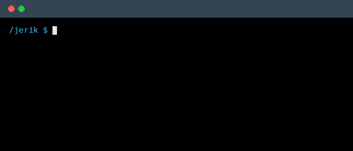

# 👋 Hey there, I'm Jerik George!

I'm a 21-year-old aspiring software developer, always excited to learn something new and build things that matter.

 

🎓 Just completed my HNC in Computing.

💼 Currently working as an IT Intern at [VividBlock](https://vividblock.com/).

🌱 Learning full-stack development — leveling up beyond front-end into back-end.

💬 Ask me about HTML, CSS, JS.

📫 Reach me at jerikgeorge2004@gmail.com.

### 🛠️ Languages & Tools

     

### 🚀 Currently Learning — Full-Stack Development

    

### 🔗 Connect with me

